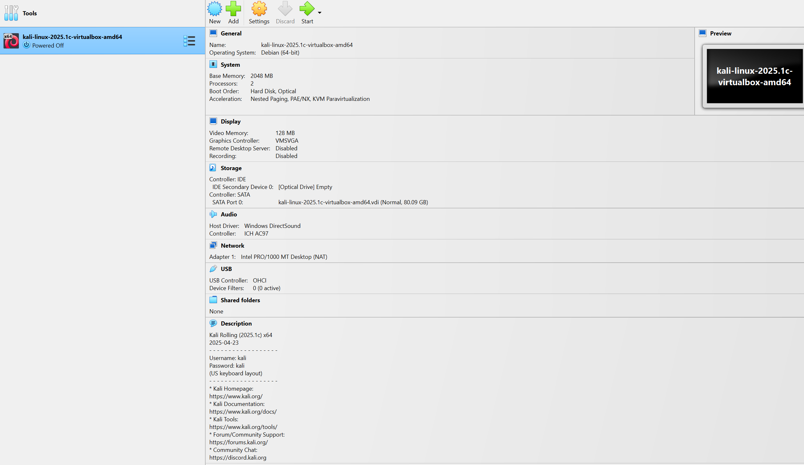
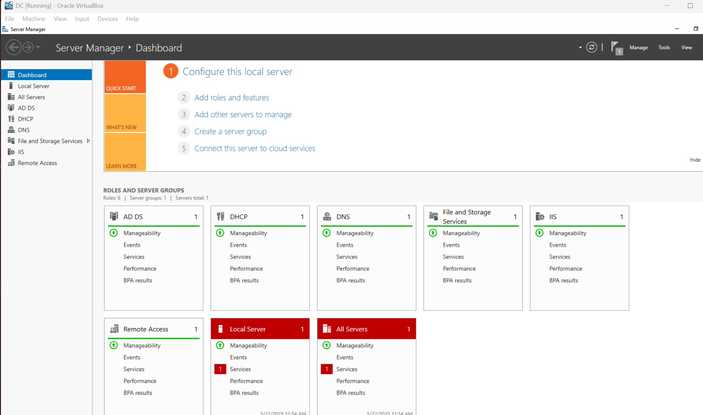
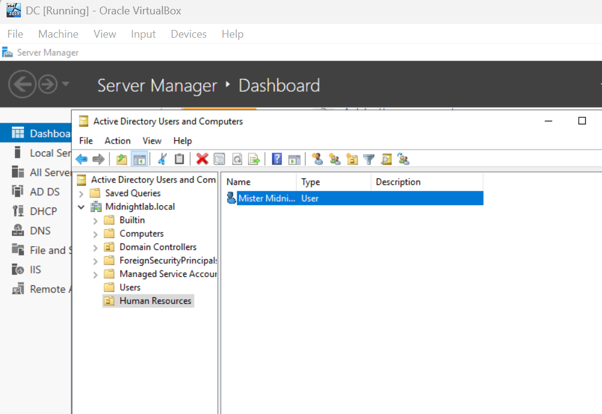
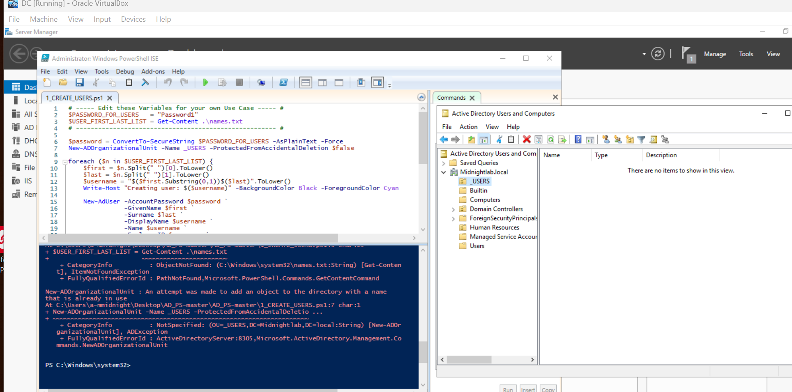
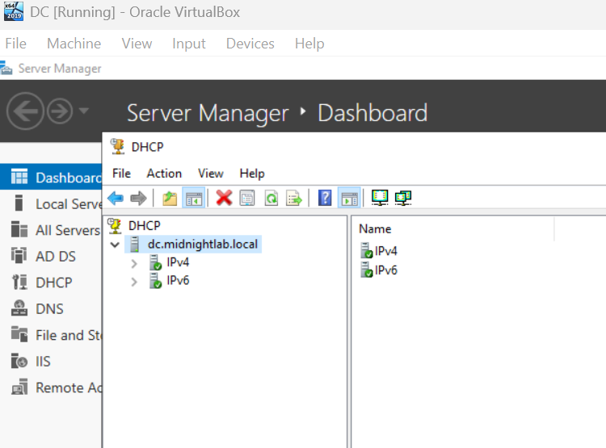
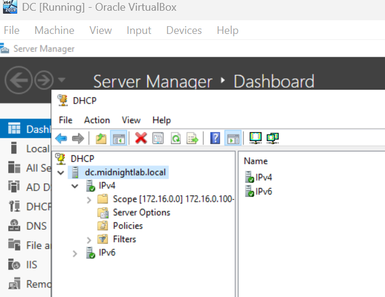
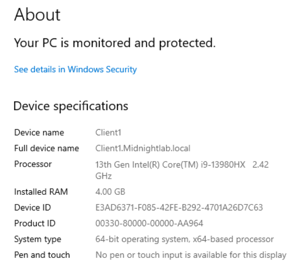
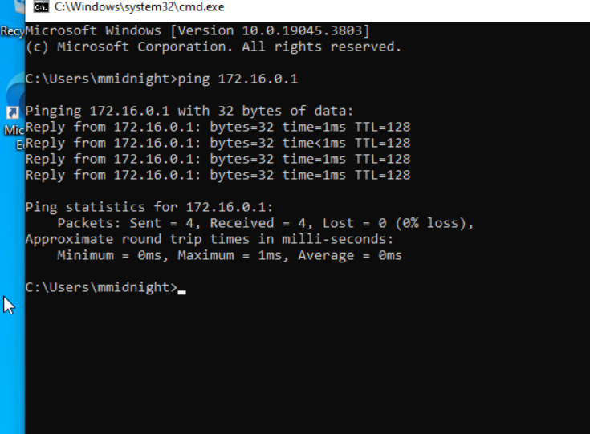

# 🧠 MidnightLabs EnterpriseSim  
## EXP Entry 001: Domain Dawn — From VM Chaos to Order

Welcome to the first entry of the **MidnightLabs Inc.** lab journal, where we brute-force enlightenment one experiment at a time. This log covers the early infrastructure grind: setting up our Active Directory domain, provisioning DHCP, configuring DNS, and onboarding our first digital employee — the one and only Mister Midnight.

---

## ☁️ Environment Overview

We spun up our playground in **VirtualBox**, assembling a ragtag crew of virtual machines to simulate a lightweight enterprise environment. Our main pieces:

- 1x Windows Server 2019 (Domain Controller)
- 1x Windows 10 Pro (Client1)
- 1x Kali Linux (for future mischief)
  

---

## 🏗️ Phase 1: Active Directory Setup

After installing the AD DS role, we created our internal domain: `Midnightlab.local`. From there, it was time to stand up the kingdom.

We carved out our first **Organizational Unit (OU)** for the Human Resources department — the true power behind any operation. Then, with ceremonial flair, we introduced **Mister Midnight**, our first test user.

We attempted automation through a PowerShell script to generate more users. Things were going smoothly... until we tried to recreate an already existing OU. The result?

So yeah — lesson learned. AD doesn’t play about namespace conflicts.

---

## 📡 Phase 2: DHCP + DNS

Next came **DHCP configuration**, because typing IPs manually is a crime against sysadmins.

We created a scope in the `172.16.0.0/24` range and made sure everything looked production-grade — minus the C-level execs breathing down our necks.

---

## 🖥️ Phase 3: Client Onboarding

With services up, we initiated our first domain join. Client1 didn’t fight us.

A quick `ping` to the Domain Controller confirmed that the network gods were pleased.

---

## 🔍 Reflection

This first arc was all about structure — laying down a domain skeleton that future experiments can corrupt, defend, or extend. Whether you're blue teaming, red teaming, or just vibing with PowerShell, this foundation is where the story begins.

Stay tuned. We’ve got plans to simulate internal phishing, SIEM monitoring, group policy enforcement, and maybe — just maybe — a little ransomware redemption arc.

---

### 🧾 Screenshots Referenced

1. `VirtualBox_KaliVM_Settings.png`
2. `ServerManager_AllRolesEnabled.png`
3. `ActiveDirectory_HR_User_MisterMidnight.png`
4. `PowerShell_AutoUserScriptError.png`
5. `DHCP_Initial_Config.png`
6. `DHCP_Scope_Setup_172.16.0.0.png`
7. `Client1_DeviceSpecs_ADJoin.png`
8. `CMD_PingDomainController.png`
9. `Wireshark_ICMP_Port_Unreachable.png`

> 📁 All images should live in your repo under: `/midnightlabs-enterprisesim/screenshots/`

---
