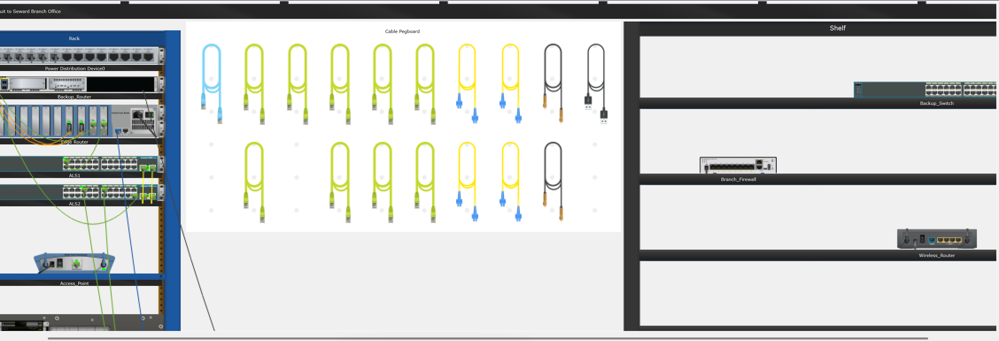

# Entry 1.1 – Physical Mode Orientation (PTPM)

This was my first hands-on orientation inside Packet Tracer’s Physical Mode, working with a simulated branch office network. The exercise focused on the basics—rack layout, cable types, router setup—but it gave me a solid sense of what real hardware interaction would feel like in a wiring closet.

---

## Rack Setup and Device Familiarity

I started by exploring the **Seward Branch Office wiring closet**. The rack was populated with two switches (ALS1 and ALS2), an edge router, and an access point. There was also a pegboard full of cables and a shelf with uninstalled backup hardware like a switch, firewall, and wireless router.

Here’s what it looked like after I finished setting things up:



This layout forced me to pay attention to where cables go, how ports are labeled, and which devices belong where. It was also the first time I actually dragged a router into a rack and powered it on manually—details that make the simulation feel more grounded.

---

## Cabling Practice

I connected **PC_1 to ALS2** using a copper straight-through cable. Then I used a **console cable** from PC_1’s RS232 port to the **Edge Router’s console port** to simulate out-of-band management. Later, I used a **USB cable** to configure the newly installed **Backup_Router** from **Laptop_1**.

This reinforced the basics:

- **Copper** for data  
- **Console or USB** for management  
- **FastEthernet0** is the common endpoint for most end devices  

---

## Basic CLI Work

After installing the Backup Router, I accessed it through the terminal and set the hostname manually:

```bash
Router> enable
Router# configure terminal
Router(config)# hostname Edge_Router_Backup
Edge_Router_Backup(config)# end
```

Small detail, but I also learned that Packet Tracer separates the **display name** from the **hostname**. You have to set both if you want visual consistency across modes.

---

## WAN vs Domain Clarification

This lab made something click for me:

A **domain** doesn’t require a WAN. It can run entirely within a LAN, like it does here in the Seward office. It’s when you start connecting different physical sites—like Seward and Warrenton—that WAN comes into play. Our current lab is simulating one office, so it’s **domain over LAN**, not WAN.

---

## Reflection

Even though this was an early-stage walkthrough, it helped me visualize how all the devices I’ve read about fit into a real-world space. It made the physical layer tangible. Also, it reminded me how naturally I gamify this process—rack builds feel like prepping units in a base, every cable like a skill being slotted. That mindset helps me stay immersed while learning.

Logging this not because it was difficult, but because it was grounding.

---
