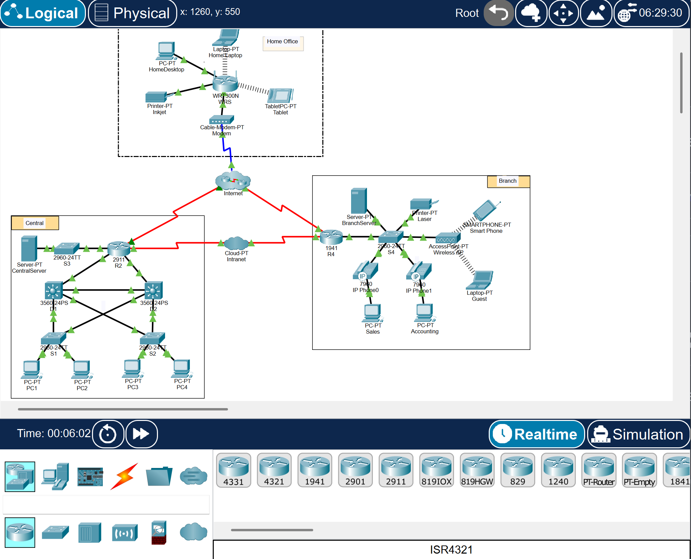
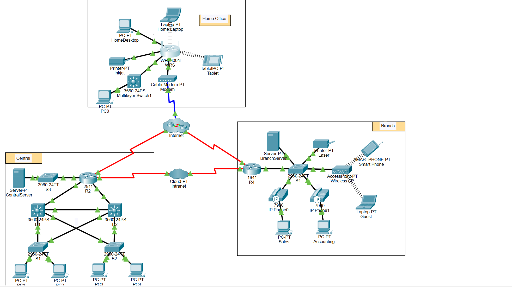

# Entry 1.2 – Network Representation & Topology Breakdown

This lab focused on visualizing and evaluating a simplified business network using Packet Tracer's Logical mode. The goal was to get familiar with different types of devices, their roles, and how LANs and WANs interact in a broader topology.

---

## 🧭 Part 1: Network Components & Media

We began by identifying intermediary devices, end devices, and media types in the topology.

**Questions & Notes:**

- **Intermediary Device Categories:** Routers, switches, access points, modems, cloud devices.
- **How many endpoint devices?** 15  
- **How many intermediary devices (excluding clouds)?** 13  
- **How many end devices aren't desktops?** 9 (including servers, phones, tablets, printers)  
- **How many types of media used?** 4  
  - Coaxial (blue)  
  - Serial DTE (red)  
  - Copper straight-through (green)  
  - Wireless (dashed lines)

---

## 🌐 Part 2: Purpose of Devices

- **Client-Server Model:** A network model where clients (PCs, tablets, phones) request resources from centralized servers.
- **Two Intermediary Functions:**  
  1. Refresh and resend data (e.g. switches and repeaters)  
  2. Route data between networks (e.g. routers)
- **Two Media Criteria:**  
  1. Network size (SOHO vs enterprise)  
  2. Speed/performance needs

---

## 🔄 Part 3: LAN vs WAN Breakdown

- **LAN:** Local area, limited to small spaces (e.g., the Home Office, Branch, and Central zones)
- **WAN:** Wide area, spans geographic locations (e.g., the red serial DTE links between clouds)
- **LAN Count in Diagram:** 3  
- **WAN Count in Diagram:** 1  
- **The Internet (as defined):** A massive interconnection of smaller networks (LANs and WANs)
- **Common Home Connection:** Via router → ISP → Internet (wired or wireless)
- **Common Business Connection (in our region):** FIOS or DSL

---

## 🧪 Challenge Tasks Attempted

**Task 1: Add a New End Device**

- I added a PC to the Home Office LAN.
- It lacked login credentials, but could still attempt communication through the router.
- If configured correctly, it would need:
  - An IP address
  - Gateway
  - DNS info

**Task 2: Add an Intermediary Device**

- I added a switch between the router and the new PC.
- If configured and connected properly, it should function as a transparent bridge, passing traffic.
- No additional config needed for the switch, unless VLANs or spanning tree are involved.

---

## 📸 Screenshots

**Logical View of Full Network Topology Before Edits**

**Logical View of Full Network Topology After Edits**

---

## 🧠 Reflection

This activity reinforced my ability to "read" a network visually—seeing not just what devices are used, but how they interact. Thinking in terms of LANs and WANs made me realize that networks are about **scope** and **relationship**, not just cables. I also appreciated the challenge section—it forced me to interact with the network creatively, even when locked out of full configuration.

As always, it’s about staying hands-on. The more I click, drag, trace, and build, the better this all starts to feel.

---
