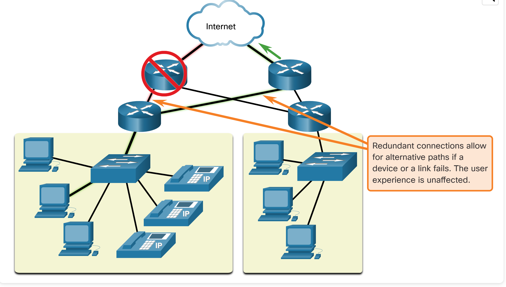
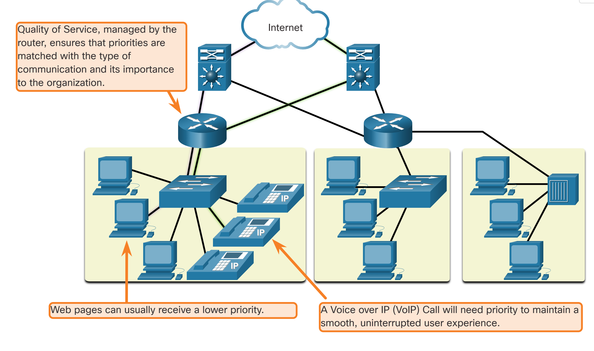
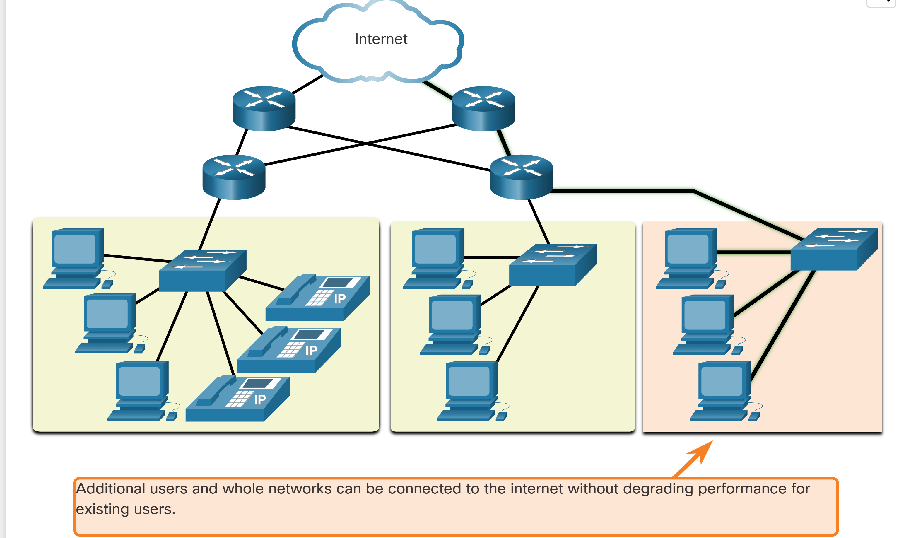
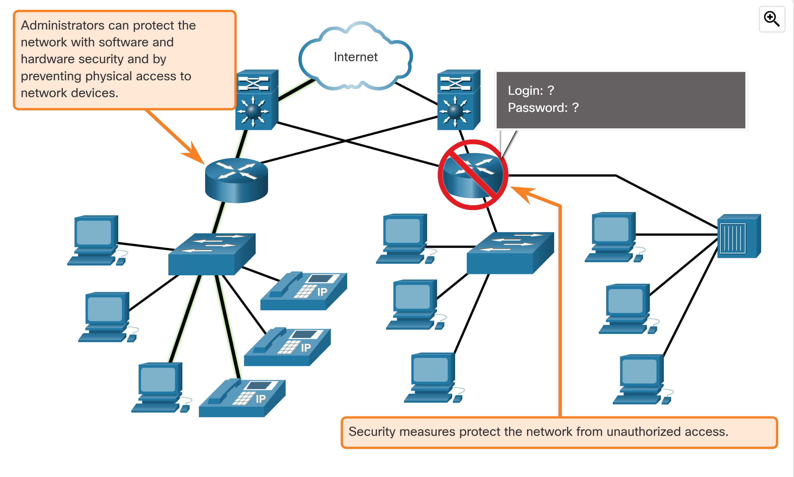

# Entry 1.3 - Core Network Design Principles

In our first milestone lab, we manually assembled a basic network topology and walked through essential design concepts. During the process, we explored four core principles that drive scalable, resilient, and user-friendly network infrastructure: **fault tolerance**, **quality of service**, **scalability**, and **security**.

These are the real-world fundamentals every network must account for—whether it’s a home setup or an enterprise-grade deployment. Below are the visuals and notes captured from the learning module, along with personalized insights that solidify our understanding.

---

## 🛡 Fault Tolerance

**Concept**: Fault tolerance ensures that when a device or link goes down, traffic can still flow through alternate paths. This guarantees uninterrupted service and a seamless user experience, even in the face of equipment failure.

**Reflection**: This diagram clarified how real-world networks rely on redundant links. I used to think one strong connection was enough—now I understand why resilience matters. Fault tolerance isn't extra, it’s survival.

---

## 🎯 Quality of Service (QoS)

**Concept**: QoS allows routers to prioritize traffic based on the type of service being used. Voice calls, video conferencing, and other delay-sensitive data get higher priority than general web browsing or background processes.

**Reflection**: I never thought about how the network decides what traffic goes first. This showed me that packets aren’t treated equally—network design involves value judgments. VoIP gets the fast lane, email can wait.

---

## 📈 Scalability

**Concept**: Scalability means the network can grow—adding more users, devices, or even entire segments—without disrupting performance for existing users.

**Reflection**: What clicked for me here was realizing that scalability isn't just about adding hardware. It’s about designing *in advance* for growth. That means segmenting, managing traffic, and leaving space in the blueprint.

---

## 🔐 Security

**Concept**: Network security involves both software and hardware protections, including restricting physical access to devices and enforcing strong login authentication. Security ensures that unauthorized users can't compromise the system.

**Reflection**: Security felt theoretical until I saw it visually here. If someone plugs into your network physically—or sniffs wireless signals—your defenses better be ready. Admin passwords, VLANs, physical lockouts—it all matters.

---

## 📓 Summary

This entry serves as a living reference of the “big four” network principles. It gave me a lens through which I now evaluate every design: **Can this setup recover from failure? Will it scale? Can it prioritize what matters? Is it secure?** If even one of those breaks down, the whole thing is fragile.

Each visual reinforced the lesson and helped me absorb the pattern—not just memorize the facts. We’re not just learning networking, we’re learning to think like architects.

---

**Log ID**: Entry 1.3  
**Type**: Between-Project Learning  
**Series**: 1.x (Post-Lab Reflection)  
**Next**: Entry 1.4 (TBD)  
