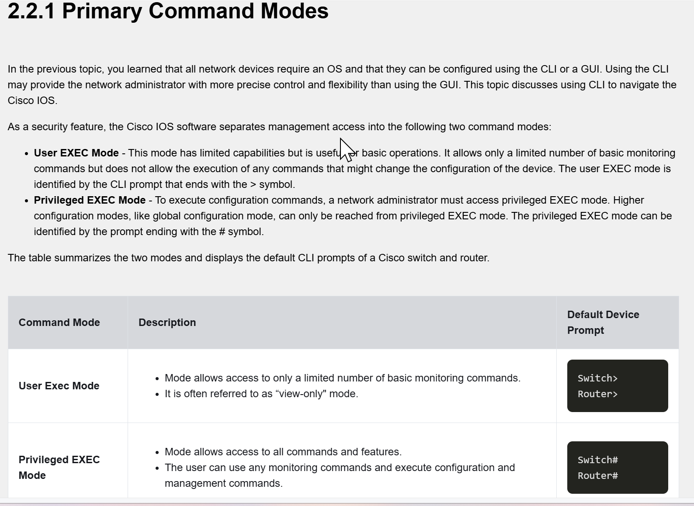
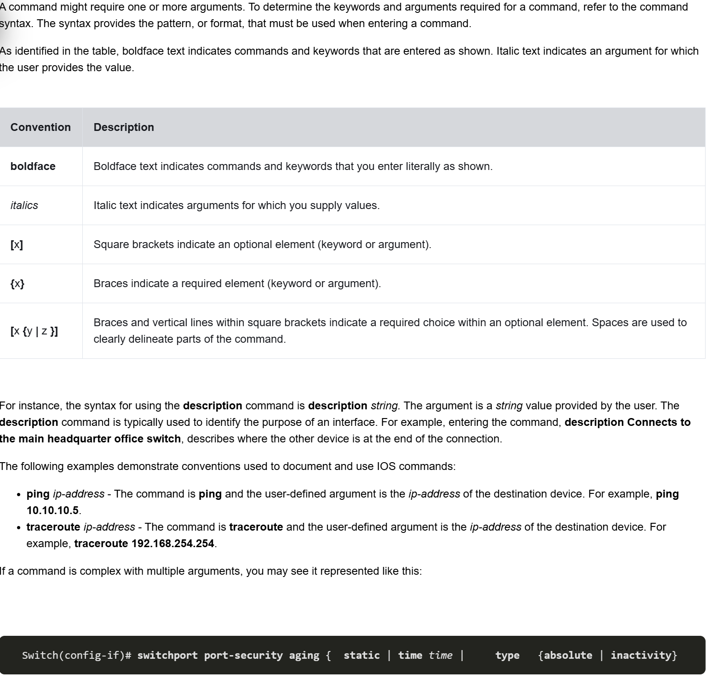
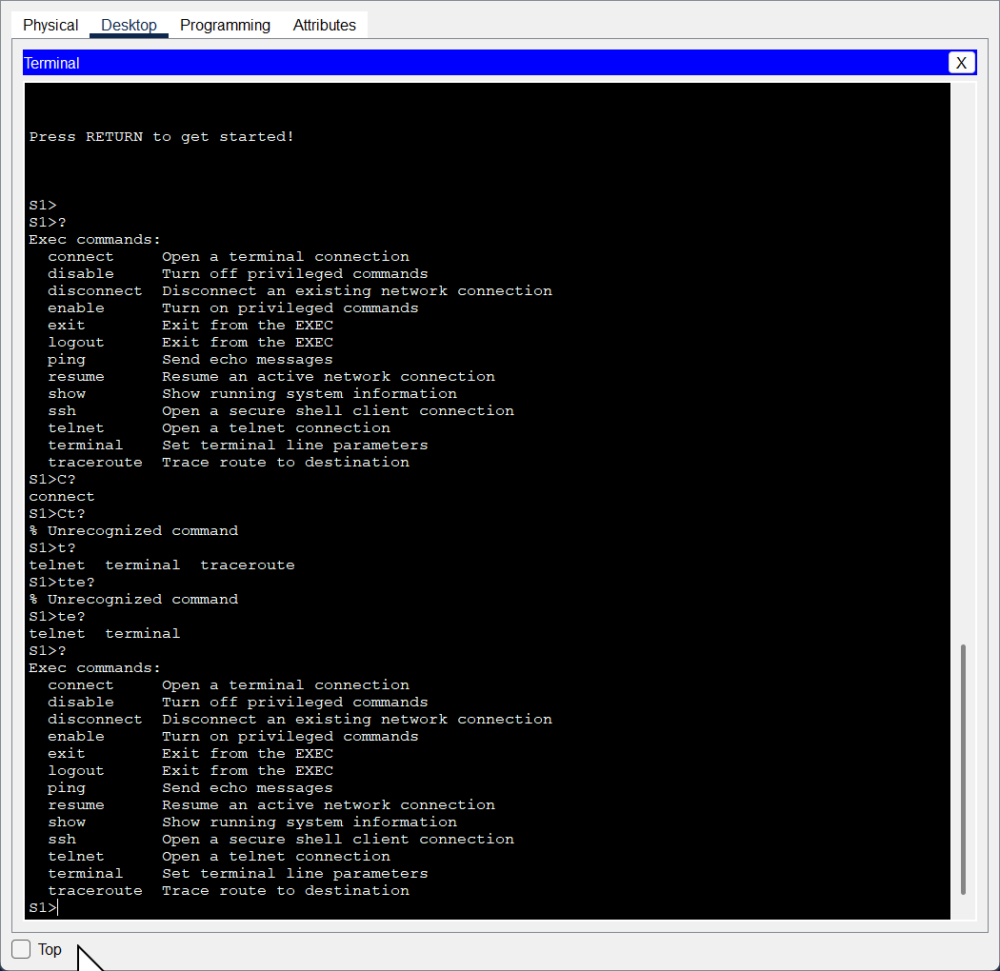
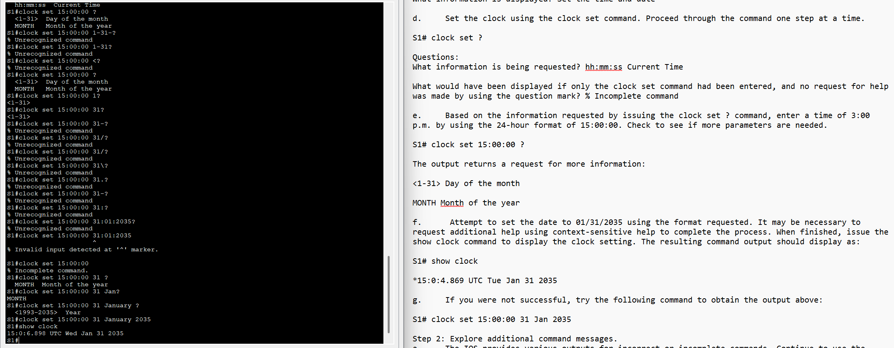
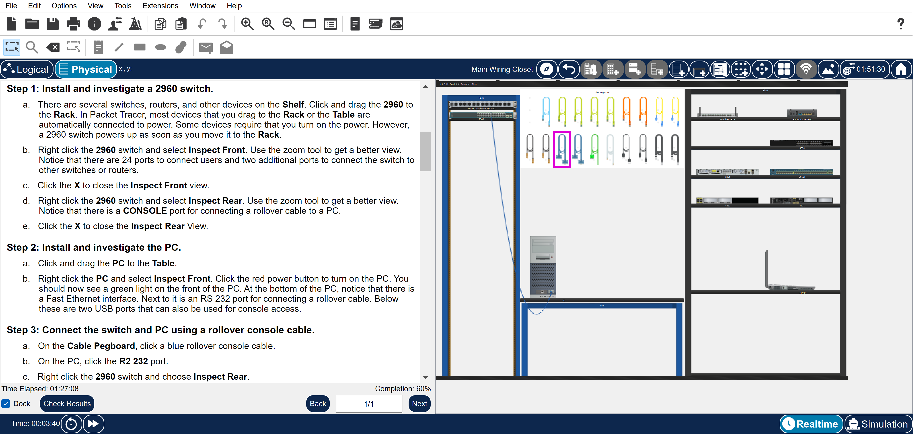
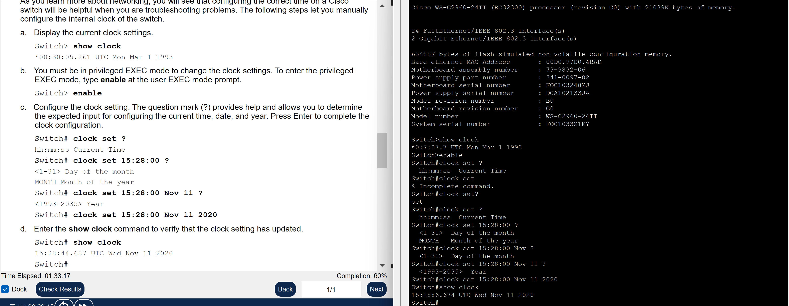

# MidnightLabs Entry 1.4  
**Title:** Navigating the IOS — Diving into the Command Line Sea

---

## 🌊 CLI as Deep Sea: A MidnightLabs Metaphor

Imagine the command line interface (CLI) as the ocean.

- **User EXEC mode** is the shoreline — you’re just dipping your toes in, viewing basic status and data.
- **Privileged EXEC mode** is snorkeling — you can see more, explore, but not change much.
- **Global Configuration mode** is deep-sea diving — you’re operating with full control of the environment.
- **Interface Config mode** puts you inside a submarine — tuning internal components like IPs and ports.
- **Line Config mode** is like being in the submarine’s radio room — you’re configuring remote access like console or SSH.

The CLI is vast. The GUI is a system of canals, structured and limited. But the CLI? It’s freedom. Ocean currents, not paved roads.

---

## 🕹️ MidnightLabs Command Submarine Controls (Hotkey Reference)

| Shortcut | Function | Analogy |
|----------|----------|---------|
| `Ctrl + A` | Jump to start of line | Swim left — WASD-style |
| `Ctrl + E` | Jump to end of line | Swim right — like pressing D |
| `Tab` | Auto-complete command | Target lock — snap to next valid cmd |
| `Up/Down Arrows` | Cycle command history | Scroll back and forth in time |
| `Ctrl + C` | Abort current command | Emergency eject |
| `Ctrl + Z` | Return to Privileged EXEC | Ascend to surface |
| `Ctrl + Shift + 6` | Interrupt running process | Kill engine mid-ping/traceroute |
| `Ctrl + R` | Redraw CLI after message | Radar recalibration |

Tab completion and command shortening help build CLI muscle memory—treat it like learning a fighting game combo.

---

## 🔧 Lab Walkthrough: Module 2.3 — Navigating IOS

This lab covered foundational IOS skills:
- Using console cable connections
- Moving between User EXEC, Privileged EXEC, and Config modes
- Understanding CLI structure
- Configuring the system clock with context-sensitive help

📸   
📸 

---

### ⚙️ Key Exercises

#### Console Setup  
Connected a console cable from PC1 to S1 and opened the CLI.  
Prompt displayed: `S1>` (User EXEC mode)

#### Tab Completion / Context-Sensitive Help  
Used `?`, `te?`, `conf t`, and `en<Tab>` to explore commands and arguments.  
Learned that:
- Tab only completes if one valid command exists
- `Ctrl + Z` or `end` exits config modes

📸 

---

### 🕰️ Clock Configuration

Walkthrough:
```shell
S1# clock set 15:00:00 31 Jan 2035
```
Used `clock ?` and `clock set ?` to explore syntax via context-sensitive help.  
Set and verified date/time using:
```shell
S1# show clock
```

📸 

---

### 🛠️ Final Physical Test Setup

Completed a physical simulation of console setup and verified configuration persistence.  

📸   
📸 

---

## 🧠 Reflections

This lab helped reinforce the value of direct CLI navigation vs GUI pathways.  
Working through command discovery and syntax via live experimentation grew intuition and confidence.  
The metaphor of diving deeper with each mode helped visualize access tiers and risks.  
This entry lays the groundwork for deeper configuration work and automation in the coming modules.

